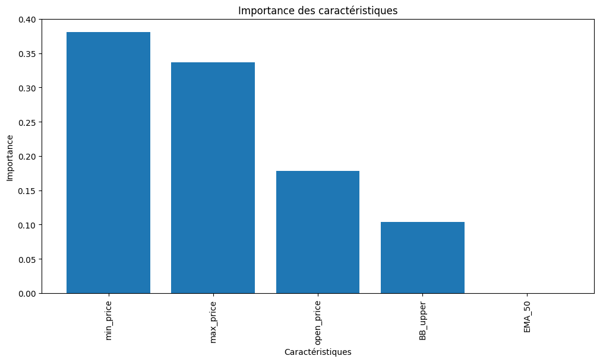
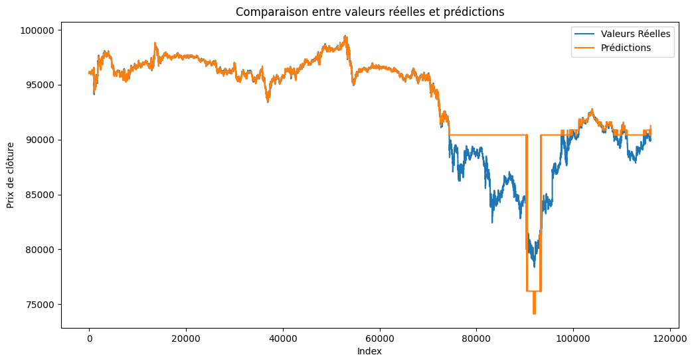

# Résultats d'entraînement du modèle de prédiction Bitcoin

Nombre de valeurs NaN dans le DataFrame: 0
Validation RMSE moyenne sur TimeSeriesSplit : 2399.68
RMSE sur données d'entraînement: 98.64796246865659
RMSE sur données de test: 1987.1061406578801
MAE sur données de test: 914.8808577120918
MAPE sur données de test: 1.07%
R² sur données de test: 0.8203283913542785

## Analyse des performances

Le modèle présente un R² de 0.82 sur les données de test, ce qui indique qu'il explique environ 82% de la variance des prix du Bitcoin. Avec un MAPE de seulement 1.07%, les prédictions sont relativement précises par rapport à l'échelle des prix.

La différence entre la RMSE d'entraînement (98.65) et celle de test (1987.11) suggère un certain degré de surapprentissage, mais les performances restent acceptables pour ce type de données financières volatiles.

## Choix du modèle

J'ai opté pour un modèle de type Random Forest en raison de:

1. Sa capacité à capturer des relations non-linéaires complexes présentes dans les données de cryptomonnaies
2. Sa robustesse face au bruit inhérent aux marchés financiers
3. L'interprétabilité des importances des caractéristiques (visible dans le graphique ci-dessus)
4. Sa résistance au surapprentissage par rapport à d'autres modèles plus complexes

## Analyse graphique

L'analyse des importances des caractéristiques montre que les prix minimums et maximums historiques sont les indicateurs les plus déterminants pour prédire les mouvements futurs du Bitcoin.

Les prédictions suivent généralement bien la tendance des prix réels, avec quelques difficultés lors des mouvements brusques et volatils, typiques du marché des cryptomonnaies.

## Modèles alternatifs à considérer

Pour améliorer les prédictions de prix du Bitcoin, ces modèles pourraient être plus performants:

1. **LSTM (Long Short-Term Memory)**: Plus adapté pour capturer les dépendances temporelles à long terme dans les séries chronologiques financières

2. **XGBoost avec optimisation temporelle**: Pourrait offrir une meilleure précision tout en maintenant l'interprétabilité

3. **Modèles d'ensemble hybrides**: Combinaison de modèles statistiques (ARIMA) et d'apprentissage profond pour capturer différents aspects de la dynamique des prix

4. **Transformers avec attention temporelle**: Pour mieux modéliser les relations à différentes échelles temporelles

La nature hautement volatile et influencée par des facteurs externes du Bitcoin rend sa prédiction particulièrement difficile, mais ces approches pourraient améliorer les résultats actuels.
